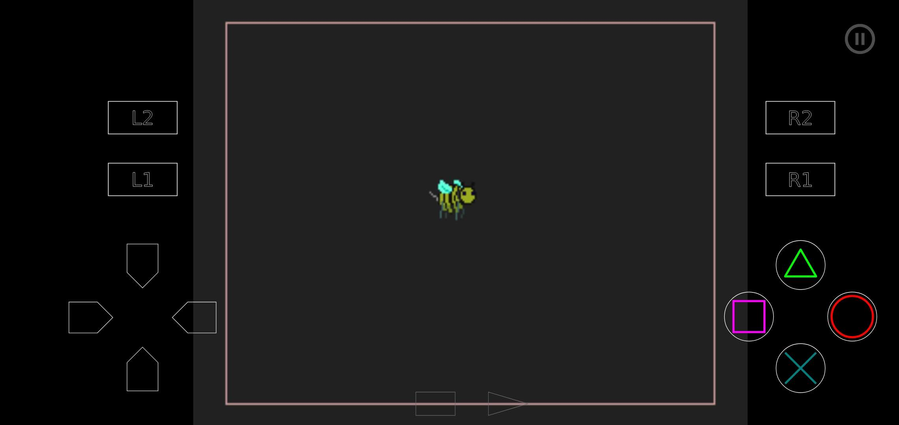
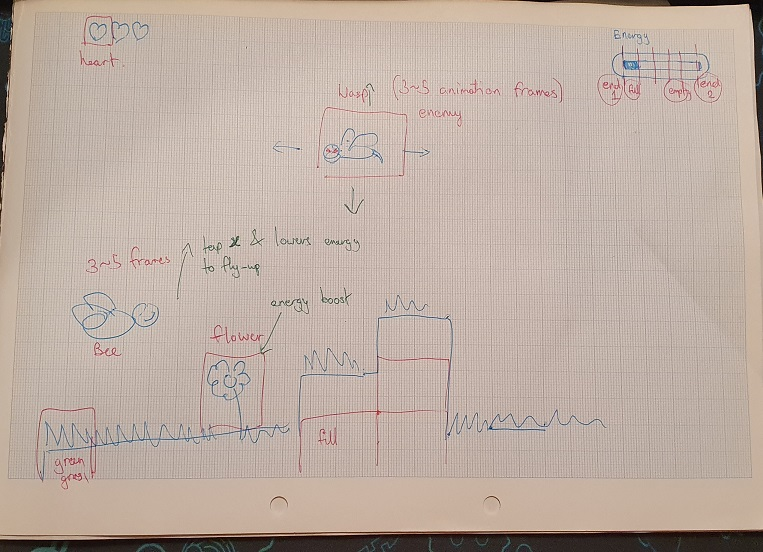

# BuzzyBee for 32bit Jam 2021  

Preparing some basic functions for the game ahead of the jam.  

## Game Concept  
  

  
It will hopefully be a simple 2D platformer. The idea is to be a cross between a side-scrolling Super Mario like game and a FlappyBird mechanics.  
That is assuming I ever get it done.  

## Video 
(https://youtu.be/r3NW8sTUX1c)

