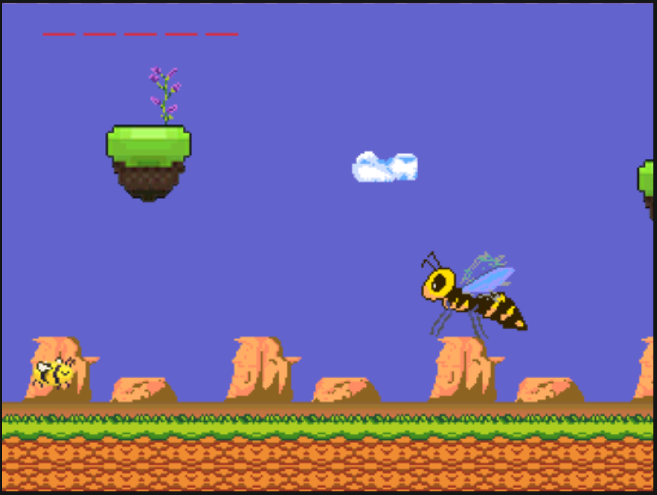
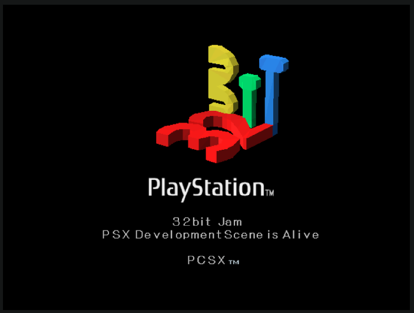
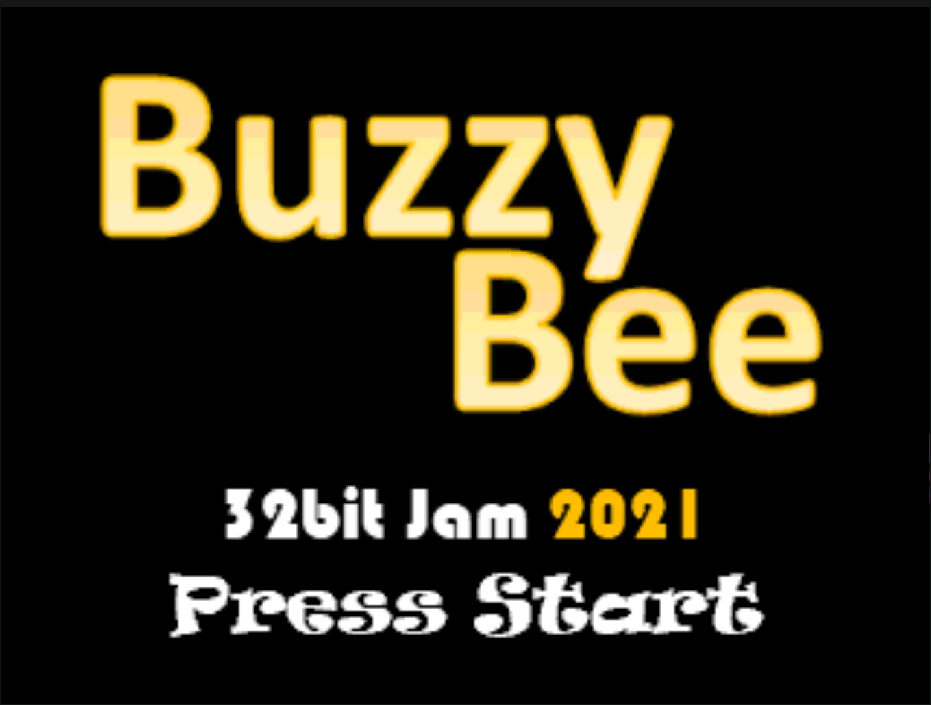

# BuzzyBee for 32bit Jam 2021  

Preparing some basic functions for the game ahead of the jam.  

## Game Concept  
  

  
It will hopefully be a simple 2D platformer. The idea is to be a cross between a side-scrolling Super Mario like game and a FlappyBird mechanics.  
That is assuming I ever get it done.  
  
### Early prototype  
We had to abondon this prototype because the author of the bee sprite bailed on us....

## Easter Egg
Adapated the logo for the 32bit jam from Arch-D-Triumph to our PSX CD boot

## Intro Screen
I did this first, but should have coded it last or made a code way of skipping it....
